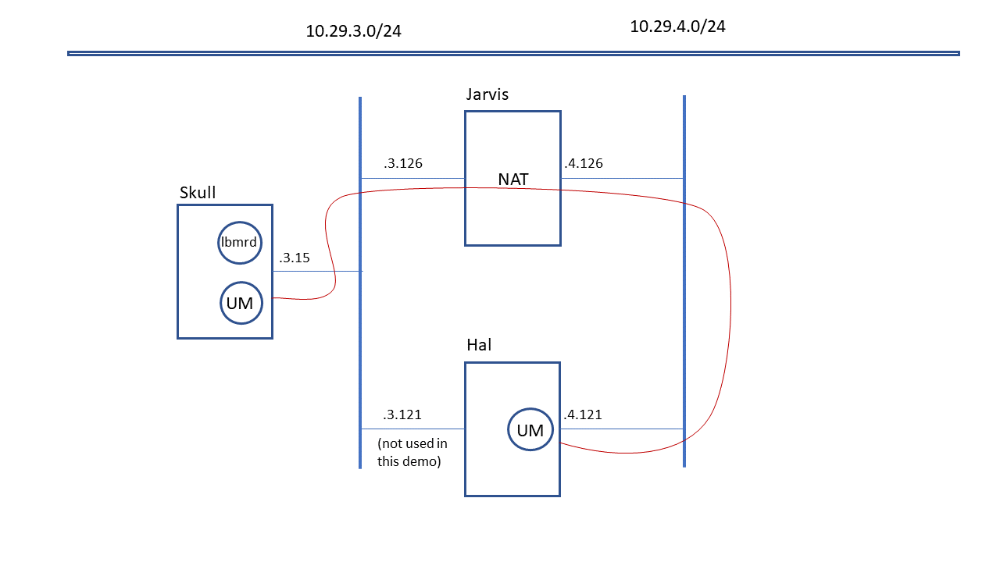

# Lbmrd NAT Notes

<!-- mdtoc-start -->
&bull; [Lbmrd NAT Notes](#lbmrd-nat-notes)  
&bull; [Disclaimer](#disclaimer)  
&nbsp;&nbsp;&nbsp;&nbsp;&bull; [If you need a functional NAT, do not use these examples!](#if-you-need-a-functional-nat-do-not-use-these-examples)  
&bull; [Topology](#topology)  
&bull; [Example One-to-many NAT](#example-one-to-many-nat)  
&nbsp;&nbsp;&nbsp;&nbsp;&bull; [Save Normal State](#save-normal-state)  
&nbsp;&nbsp;&nbsp;&nbsp;&bull; [Restore Normal State](#restore-normal-state)  
&nbsp;&nbsp;&nbsp;&nbsp;&bull; [Start the NAT Running](#start-the-nat-running)  
&nbsp;&nbsp;&nbsp;&nbsp;&bull; [Set Skull Route](#set-skull-route)  
&nbsp;&nbsp;&nbsp;&nbsp;&bull; [Ping Test](#ping-test)  
&nbsp;&nbsp;&nbsp;&nbsp;&bull; [TCP Test](#tcp-test)  
&nbsp;&nbsp;&nbsp;&nbsp;&bull; [UDP Test](#udp-test)  
&nbsp;&nbsp;&nbsp;&nbsp;&bull; [UM Test](#um-test)  
&nbsp;&nbsp;&nbsp;&nbsp;&nbsp;&nbsp;&nbsp;&nbsp;&bull; [Configure Lbmrd](#configure-lbmrd)  
&nbsp;&nbsp;&nbsp;&nbsp;&nbsp;&nbsp;&nbsp;&nbsp;&bull; [Configure UM](#configure-um)  
<!-- TOC created by './mdtoc.pl kb/lbmrd-nat-notes.md' (see https://github.com/fordsfords/mdtoc) -->
<!-- mdtoc-end -->

There are two common methods for traversing a NAT router with UM:

1. DRO with peer links. This is the easiest and most functional method. All you need is to be able to establish a single TCP connection from one side (the initiator) to the other.
2. Use the "lbmrd" for unicast UDP topic resolution, and configure the lbmrd for NAT usage. This method has the advantage of lower latency, but the disadvantage that not all of UM's functionality is available.

This article is about the lbmrd method, and presents an extended example.

# Disclaimer

I am not an expert at configuring routers, including NAT routers. If you are having trouble working with a NAT, the UM support team may be able to help you, but you will also need your network administrators available for consultation.

We worked with a customer who said that their NAT forwarded traffic for all ports. It turned out that the NAT contained multiple stages, and the customer only had visibility on one stage. That stage did indeed forward traffic for all ports. However, a different stage (which was administered by a different group) was blocking all but a few ports. The customer needed to get administrative approval for the UM ports before they could be opened up.

## If you need a functional NAT, do not use these examples!

This article contains example NATs that I created using iptables on one of our Linux hosts. They are not representative of production NAT deployments. They are intended to demonstrate how to configure UM to work in a NAT environment, not to demonstrate the right way to create a NAT.

# Topology

We have two networks: 10.29.3.0/24 and 10.29.4.0/24. In our lab, the .3 network is routed to the corporate network and has access to the public Internet. The .4 network is isolated and can only be accessed by logging into a host that has both a .3 and a .4 interface. For this demonstration, consider the following hosts:



In this setup, the .3 network should be considered the main UM deployment, and the "lbmrd" is running there. The .4 network is considered the external network.

# Example One-to-many NAT

See [my personal article](https://github.com/fordsfords/fordsfords.github.io/wiki/NAT-notes) for a short tutorial of what a [one-to-many](https://en.wikipedia.org/wiki/Network_address_translation#One-to-many_NAT) NAT is.

One characteristic of this kind of NAT is that the internal hosts can directly access external hosts by their true IP address. I.e. Skull should be able to directly access Hal by its .4 address, through the NAT router. However, Hal cannot access Skull by its .3 address; it needs to use the NAT's address.

## Save Normal State

Messing with a host's network settings carries the risk that you'll [saw off the branch you're setting on](https://www.youtube.com/watch?v=WXpmdOlfFX4) and be unable to log back in to undo your mistake. You might need to log into the physical console to undo it.

So first let's save the current settings.

As root on Jarvis:
````
# cat /proc/sys/net/ipv4/ip_forward >/var/tmp/ip_forward.save
# iptables-save >/var/tmp/iptables.save
````

## Restore Normal State

Done experimenting? You should put the system back the way it should be.

As root on Jarvis:
````
# cat /var/tmp/ip_forward.save >/proc/sys/net/ipv4/ip_forward
# cat /var/tmp/ip_tables.save | iptables-restore
````

## Start the NAT Running

In my experimental topology, the .3 network is the internal, and .4 is the external. To make sense out of this, you need to know the device names associated with the IP interfaces.
* eno1: 10.29.3.126 - internal
* ens4f0np0: 10.29.4.126 - external

As root on Jarvis:
````
# echo 1 >/proc/sys/net/ipv4/ip_forward
# iptables -t nat -A POSTROUTING -o ens4f0np0 -j MASQUERADE
# iptables -A FORWARD -i ens4f0np0 -o eno1 -m state --state RELATED,ESTABLISHED -j ACCEPT
# iptables -A FORWARD -i eno1 -o ens4f0np0 -j ACCEPT
````

Now need to open up TCP and UDP ports so that the external system (Hal) can reach the internal system (Skull). In a real deployment, a smaller port range would be desired, but for experimentation, better to make it bigger.
````
# iptables -t nat -A PREROUTING -i ens4f0np0 -p udp --dport 12000:12999 -j DNAT --to 10.29.3.15
# iptables -t nat -A PREROUTING -i ens4f0np0 -p tcp --dport 12000:12999 -j DNAT --to 10.29.3.15
````

## Set Skull Route

We want Skull to be able to access Hal directly by it's .4 address, through the NAT. But our .4 network is not connected to our main switch, it is an isolated network. So we need to set up a route through the NAT we started on Jarvis (.3.126). Note that Skull's .3 interface device name is ens192 (it's a VM).

As root on Skull:
````
# ip route add 10.29.4.0/24 via 10.29.3.126 dev ens192
````

## Ping Test

Let's start with a ping from Skull to Hal. But let's make sure it's going through Jarvis with tcpdump. So we'll need two windows open to Skull.

Skull window 1:
````
$ ping 10.29.4.121
PING 10.29.4.121 (10.29.4.121) 56(84) bytes of data.
64 bytes from 10.29.4.121: icmp_seq=1 ttl=63 time=0.338 ms
64 bytes from 10.29.4.121: icmp_seq=2 ttl=63 time=0.447 ms
...
````

Skull window 2 as root:
````
# tcpdump -i ens192 -e host 10.29.4.121
tcpdump: verbose output suppressed, use -v or -vv for full protocol decode
listening on ens192, link-type EN10MB (Ethernet), capture size 262144 bytes
16:46:18.896422 00:0c:29:36:45:11 (oui Unknown) > e4:54:e8:85:0b:88 (oui Unknown), ethertype IPv4 (0x0800), length 98: skull > 10.29.4.121: ICMP echo request, id 62271, seq 284, length 64
16:46:18.896884 e4:54:e8:85:0b:88 (oui Unknown) > 00:0c:29:36:45:11 (oui Unknown), ethertype IPv4 (0x0800), length 98: 10.29.4.121 > skull: ICMP echo reply, id 62271, seq 284, length 64
...
````
The ping requests are going from mac address 00:0c:29:36:45:11 to e4:54:e8:85:0b:88. Let's check on Jarvis:
````
$ ifconfig eno1
eno1: flags=4163<UP,BROADCAST,RUNNING,MULTICAST>  mtu 1500
        inet 10.29.3.126  netmask 255.255.255.0  broadcast 10.29.3.255
        inet6 fe80::e654:e8ff:fe85:b88  prefixlen 64  scopeid 0x20<link>
        ether e4:54:e8:85:0b:88  txqueuelen 1000  (Ethernet)
...
````
Yes, the ping requests are going to Jarvis' .3 interface and the responses are coming back from there.

This is probably overkill, but let's check on hal also.
````
# tcpdump -i ens4f0np0 -e host 10.29.4.126
tcpdump: verbose output suppressed, use -v or -vv for full protocol decode
listening on ens4f0np0, link-type EN10MB (Ethernet), capture size 262144 bytes
17:01:57.906331 00:0f:53:79:9a:d0 (oui Unknown) > 00:0f:53:79:8c:50 (oui Unknown), ethertype IPv4 (0x0800), length 98: 10.29.4.126 > hal: ICMP echo request, id 63630, seq 70, length 64
17:01:57.906363 00:0f:53:79:8c:50 (oui Unknown) > 00:0f:53:79:9a:d0 (oui Unknown), ethertype IPv4 (0x0800), length 98: hal > 10.29.4.126: ICMP echo reply, id 63630, seq 70, length 64
````
This time the ping requests are coming from 00:0f:53:79:9a:d0. Let's check Jarvis again:
````
$ ifconfig ens4f0np0
ens4f0np0: flags=4163<UP,BROADCAST,RUNNING,MULTICAST>  mtu 1500
        inet 10.29.4.126  netmask 255.255.255.0  broadcast 10.29.4.255
        inet6 fe80::20f:53ff:fe79:9ad0  prefixlen 64  scopeid 0x20<link>
        ether 00:0f:53:79:9a:d0  txqueuelen 1000  (Ethernet)
...
````
Yup, the ping request are going from Skull, through Jarvis, and to Hal's .4 interface.

## TCP Test

Now let's use [mtools](https://github.com/UltraMessaging/mtools) to do a tcp test.

On Hal:
````
$ mdump -v -t 0.0.0.0 12000 10.29.4.121
Equiv cmd line: mdump -p0 -Q0 -r4194304 -t -v 0.0.0.0 12000 10.29.4.121
````

On Skull:
````
$ msend -t -n 5 10.29.4.121 12000
Equiv cmd line: msend -b1 -m0 -n5 -p1000 -s0 -S65536 -t 10.29.4.121 12000
Sending 5 bursts of 1 variable-length messages
Sending 9 bytes
Sending 9 bytes
Sending 9 bytes
Sending 9 bytes
Sending 9 bytes
5 messages sent
````

Back to Hal:
````
t$  mdump -v -t 0.0.0.0 12000 10.29.4.121
Equiv cmd line: mdump -p0 -Q0 -r4194304 -t -v 0.0.0.0 12000 10.29.4.121
17:11:21.833828 10.29.4.126.45992 81 bytes:
65 63 68 6f 20 73 65 6e 64 65 72 20 65 71 75 69         echo sender equi
76 20 63 6d 64 3a 20 6d 73 65 6e 64 20 2d 62 31         v cmd: msend -b1
20 2d 6d 30 20 2d 6e 35 20 2d 70 31 30 30 30 20          -m0 -n5 -p1000 
2d 73 30 20 2d 53 36 35 35 33 36 20 2d 74 20 31         -s0 -S65536 -t 1
30 2e 32 39 2e 34 2e 31 32 31 20 31 32 30 30 30         0.29.4.121 12000
00                                                      .               
echo sender equiv cmd: msend -b1 -m0 -n5 -p1000 -s0 -S65536 -t 10.29.4.121 12000
17:11:22.834337 10.29.4.126.45992 9 bytes:
4d 65 73 73 61 67 65 20 30                              Message 0       
17:11:23.834582 10.29.4.126.45992 9 bytes:
4d 65 73 73 61 67 65 20 31                              Message 1       
17:11:24.834981 10.29.4.126.45992 9 bytes:
4d 65 73 73 61 67 65 20 32                              Message 2       
17:11:25.835030 10.29.4.126.45992 9 bytes:
4d 65 73 73 61 67 65 20 33                              Message 3       
17:11:26.835335 10.29.4.126.45992 9 bytes:
4d 65 73 73 61 67 65 20 34                              Message 4       
EOF
````
See that Hal thinks the connection is from .4.126, which is Jarvis.

Let's turn it around and initiate the connection from Hal. First Skull:
````
$  mdump -v -t 0.0.0.0 12000 10.29.3.15
Equiv cmd line: mdump -p0 -Q0 -r4194304 -t -v 0.0.0.0 12000 10.29.3.15
````

But Hal can't see Skull's real IP address, so it has to send to the NAT's IP, which is configured to forward to skull.
On Hal:
````
$ msend -b1 -m0 -n5 -p1000 -s0 -S65536 -t 10.29.4.126 12000
Equiv cmd line: msend -b1 -m0 -n5 -p1000 -s0 -S65536 -t 10.29.4.126 12000
Sending 5 bursts of 1 variable-length messages
Sending 9 bytes
Sending 9 bytes
Sending 9 bytes
Sending 9 bytes
Sending 9 bytes
5 messages sent
````

Back to Skull:
````
$  mdump -v -t 0.0.0.0 12000 10.29.3.15
Equiv cmd line: mdump -p0 -Q0 -r4194304 -t -v 0.0.0.0 12000 10.29.3.15
17:15:58.695614 10.29.4.121.48176 81 bytes:
65 63 68 6f 20 73 65 6e 64 65 72 20 65 71 75 69         echo sender equi
76 20 63 6d 64 3a 20 6d 73 65 6e 64 20 2d 62 31         v cmd: msend -b1
20 2d 6d 30 20 2d 6e 35 20 2d 70 31 30 30 30 20          -m0 -n5 -p1000 
2d 73 30 20 2d 53 36 35 35 33 36 20 2d 74 20 31         -s0 -S65536 -t 1
30 2e 32 39 2e 34 2e 31 32 36 20 31 32 30 30 30         0.29.4.126 12000
00                                                      .               
echo sender equiv cmd: msend -b1 -m0 -n5 -p1000 -s0 -S65536 -t 10.29.4.126 12000
17:15:59.696361 10.29.4.121.48176 9 bytes:
4d 65 73 73 61 67 65 20 30                              Message 0       
17:16:00.696963 10.29.4.121.48176 9 bytes:
4d 65 73 73 61 67 65 20 31                              Message 1       
17:16:01.697357 10.29.4.121.48176 9 bytes:
4d 65 73 73 61 67 65 20 32                              Message 2       
17:16:02.697612 10.29.4.121.48176 9 bytes:
4d 65 73 73 61 67 65 20 33                              Message 3       
17:16:03.698433 10.29.4.121.48176 9 bytes:
4d 65 73 73 61 67 65 20 34                              Message 4       
EOF
````
Skull sees the actual IP address of Hal, but a tcpdump will show the ethernet address is Jarvis.

## UDP Test

I'm not going to show the results here, but I did run the unicast UDP form of msend/mdump. Basically on mdump omit the "-t", and on msend change "-t" to "-u".

## UM Test

Note that NATs are generally not set up to forward Multicast (although we have seen at least one that does). For this example, I tested LBT-RU and TCP only.

### Configure Lbmrd

The lbmrd runs on Skull on the internal network.

Here's the "lbmrd.xml" file:
````
<?xml version="1.0" encoding="UTF-8" ?>
<!-- external (hal) source: its TIR does *not* need modified.
     internal (skull) source: its TIR *does* need modified.
  -->
<lbmrd version="1.0">
  <daemon>
    <port>12000</port>
    <interface>10.29.3.0/24</interface>
  </daemon>
  <domains>
    <domain name="internal3">
      <network>10.29.3.0/24</network>
    </domain>
    <domain name="external4">
      <network>10.29.4.0/24</network>
    </domain>
  </domains>
  <transformations>
    <transform source="internal3" destination="external4">
      <rule>
        <match address="10.29.3.15" port="*"/>
        <replace address="10.29.4.126" port="*"/>
      </rule>
    </transform>
  </transformations>
</lbmrd>
````

The "domain" definitions are used by the lbmrd when it receives a TIR (source advertisement) from a UM instance. It uses the source's IP address in the TIR to decide which set of transformation rules to apply (if any). So with the above configuration, TIRs from internal3 being sent to clients in external4 will have the contents of the TIR transformed by replacing 10.29.3.15 (Skull) with 10.29.4.126 (Jarvis, the NAT router). This is because when Hal in external4 gets the TIR, it can't access the original .3 IP address. It has to access Jarvis' .4.126 interface, which will then be forwarded by the NAT to skull.

There does NOT need to be an opposite direction transformation because the one-to-many NAT allows internal3 hosts to directly address the external4 addresses.

### Configure UM

Here's the UM config for Hal:
````
context resolver_unicast_daemon 10.29.4.126:12000
context default_interface 10.29.4.121
source transport LBTRU

context fd_management_type epoll
# Shorten RU activity timeout just to make the test run faster.
receiver transport_lbtru_activity_timeout 5000
receiver transport_lbtru_nak_generation_interval 4000

# TCP ports
context transport_tcp_port_low 12001
context transport_tcp_port_high 12049
context request_tcp_port_low 12051
context request_tcp_port_high 12099

# UDP ports
source transport_lbtrm_destination_port 12000
context resolver_unicast_port_low 12002
context resolver_unicast_port_high 12006
context resolver_unicast_destination_port 12008
receiver transport_lbtru_port_low 12010
receiver transport_lbtru_port_high 12029
context transport_lbtru_port_low 12080
context transport_lbtru_port_high 12089
````
It accesses Skull's "lbmrd" via the Jarvis's .4 address, which forwards to Skull. Note that it configures the source for transport LBT-RU. It works just as well for transport TCP.

Here's the UM config for UM apps running on Skull (only the first two lines are different):
````
context resolver_unicast_daemon 10.29.3.15:12000
context default_interface 10.29.3.15
source transport LBTRU

context fd_management_type epoll
# Shorten RU activity timeout just to make the test run faster.
receiver transport_lbtru_activity_timeout 5000
receiver transport_lbtru_nak_generation_interval 4000

# TCP ports
context transport_tcp_port_low 12001
context transport_tcp_port_high 12049
context request_tcp_port_low 12051
context request_tcp_port_high 12099

# UDP ports
source transport_lbtrm_destination_port 12000
context resolver_unicast_port_low 12002
context resolver_unicast_port_high 12006
context resolver_unicast_destination_port 12008
receiver transport_lbtru_port_low 12010
receiver transport_lbtru_port_high 12029
context transport_lbtru_port_low 12080
context transport_lbtru_port_high 12089
````
It simply references the lbmrd by its real IP address.

At this point, any number of apps on Hal and Skull can interoperate with either the TCP or LBTRU protocols.
