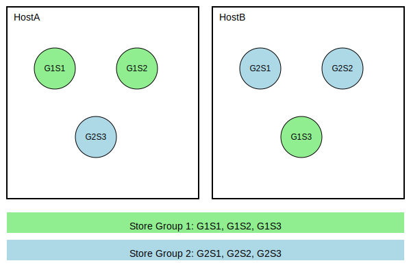

# Two Store Hosts

How some UM users reduce their server count by only running two Store servers instead of three.

<!-- mdtoc-start -->
&bull; [Two Store Hosts](#two-store-hosts)  
&nbsp;&nbsp;&nbsp;&nbsp;&bull; [Introduction](#introduction)  
&nbsp;&nbsp;&nbsp;&nbsp;&bull; [Store Groups](#store-groups)  
&nbsp;&nbsp;&nbsp;&nbsp;&bull; [Two Hosts Instead of Three](#two-hosts-instead-of-three)  
&nbsp;&nbsp;&nbsp;&nbsp;&nbsp;&nbsp;&nbsp;&nbsp;&bull; [Outage](#outage)  
&nbsp;&nbsp;&nbsp;&nbsp;&nbsp;&nbsp;&nbsp;&nbsp;&bull; [Restart](#restart)  
&nbsp;&nbsp;&nbsp;&nbsp;&bull; [Why Not Two Stores?](#why-not-two-stores)  
<!-- TOC created by './mdtoc.pl kb/two-store-hosts.md' (see https://github.com/fordsfords/mdtoc) -->
<!-- mdtoc-end -->

## Introduction

This article describes a method for running UM Stores on two servers instead of the normal three.

The goals of this solution is to provide comperable data redundancy and failure resiliency.

## Store Groups

A little-used (and little-documented) feature in UM is having multiple Store groups.
A Store group operates as a single conceptual entity of storage,
with an odd number of members providing resiliency;
as long as a quorum of stores is operational, the applications can function normally.

UM also allows the definition of more than one Q/C group.
So you might have three Stores in group 1 and three Stores in group 2,
for a total of six Stores.

There aren't very many compelling use caes for multiple Store groups,
a few customers have used it as part of a server reduction effort.

## Two Hosts Instead of Three

In this configuration, two groups of three Stores each are deployed across two hosts.

1.	Define two groups: 1 and 2.
This is done using the "group index" field of a Store specification, as described in
[ume_store (source)](https://ultramessaging.github.io/currdoc/doc/Config/grpultramessagingpersistence.html#umestoresource)
or
[ume_store_name (source)](https://ultramessaging.github.io/currdoc/doc/Config/grpultramessagingpersistence.html#umestorenamesource).
2.	Configure
[ume_retention_intergroup_stability_behavior (source)](https://ultramessaging.github.io/currdoc/doc/Config/grpultramessagingpersistence.html#umeretentionintergroupstabilitybehaviorsource)
to “any”.
3.	Each group consists of a 3-Store Quorum Consensus. So group 1 has stores G1S1, G1S2, and G1S3, and group 2 has Stores G2S1, G2S2, and G2S3.
4.	You have two hosts: A and B.
5.	On HostA you run two Stores from G1 and one Store from G2. On HostB you run one Store from G1 and two Stores from G2.

### Outage

If HostA crashes, you lose quorum on group 1, but HostB still gives you quorum on group 2.
Normal operation can continue.

### Restart

Let's say HostA is brought back up.
If possible, retain the state and cache files for the three Stores.
Upon restarting the three Stores, they will try to recover some messages from the
publishers, but in many cases will not be able to, and will therefore experience
unrecoverable loss. This is acceptable because the Stores on HostB have all
messages, triple-redundant.

However, sometimes it is not possible to retain the state and cache files,
as when a different server must be used.
In this case it is important NOT to bring up all three Stores.
You should only bring up one store from each group.

In the above example, if HostA restarts without state, then only G1S1 and G3S3
should be brought up.
This must be done so that you don't have any Store group with a quorum of Stores that have no saved state.
Otherwise a restarting publisher might register with the empty Stores and achieve quorum, and start without
knowledge of previous state.
This can cause a variety of problems.

## Why Not Two Stores?

Why can’t we have two groups, with each group as a single-Store Q/C?
Then you have two hosts, with HostA running store G1S1 and HostB running G2S1.

The problem happens when a host goes down hard, and you need to bring the Store back up in a clean state.
Now you have both Stores running, one with zero state and the other with maintained state.
Now bounce a source.
It has a 50% chance of registering with the clean Store.
And since that is sufficient for quorum, it establishes the new source’s state,
with sequence number 0, instead of the sequence number it left off with.
